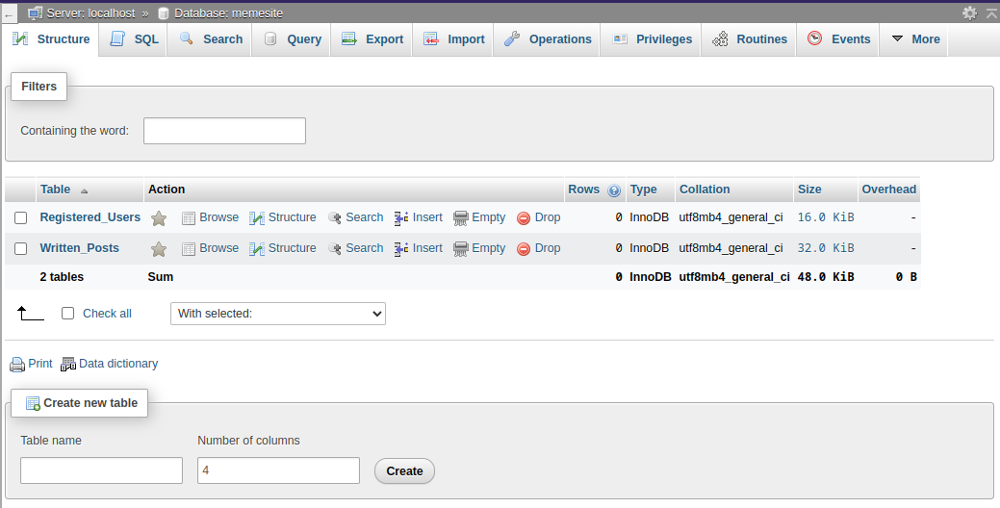
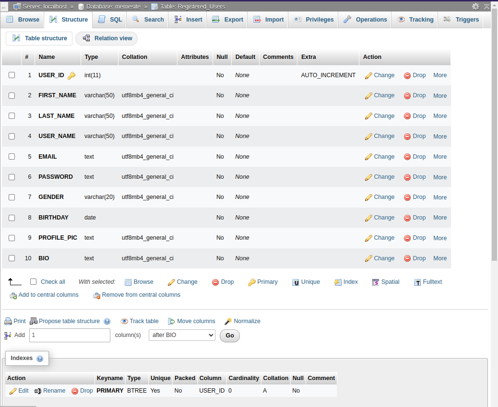
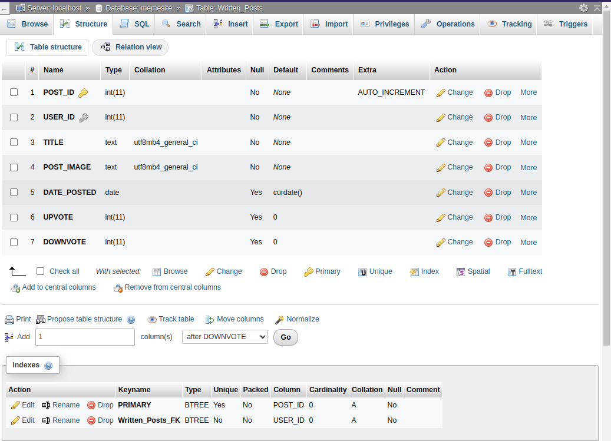

# Web Development Project

<p align="center">
   
</p>

You can edit or optimize the code, Just follow the Rules

## This is the Web Development Project Repository for Finals

<p align="center">
   
</p>

### Table of Contents:
* [Contributing Members](#Contributing-Members)
* [Dependencies](#Dependencies)
* [Rules for Maintaining This Project](#Rules-for-Maintaining-This-Project)
* [Things To Do](#Things-To-Do)
* [Database](#Database)

<br>

#### Contributing Members:

* Gomez (alexxShandsome)
* Arganda (earlylalo)
* Encabo (orly20)

#### Dependencies:

* Bootstrap Version 5
* XAMPP
* XAMPP for Linux

#### Rules for Maintaining This Project

* Use TABS for indention for uniformity in all editors that uses TABS, do not convert tabs to spaces.
* Follow Proper indention formatting.
* Code readability is priority, "It's okay to be buggy as long as readable".
* Push changes in the ```testing``` branch because ```main``` is for production only, which means it should be stable and has little bugs.
* Every page should have their own separate CSS file.
* Create an Issue Report in the "[Issues](https://github.com/alexxShandsome/Web_Development_Project/issues)" tab.

#### Things To Do:

* Change Color Scheme (Lean more on Pastel or Lighter color)
* Redesign Landing Page (```landing.php```)
* Redesign Registration Page (```registration.php```)
* Redesign Login Page (```login.php```)
* Redesign New Post Page (```new_post.php```)
* Improve Navbar design (```navbar.php``` and ```logged_in_navbar.php```)

<br>

### Database

__Database Name:__ ```memesite```

**Query to setup MySQL Database:**

```sql
CREATE DATABASE memesite;
USE memesite;
SELECT CURRENT_DATE();

CREATE TABLE Registered_Users (
   USER_ID INT NOT NULL AUTO_INCREMENT,
   FIRST_NAME VARCHAR(50) NOT NULL,
   LAST_NAME VARCHAR(50) NOT NULL,
   USER_NAME VARCHAR(50) NOT NULL,
   EMAIL TEXT NOT NULL,
   PASSWORD TEXT NOT NULL,
   GENDER VARCHAR(20) NOT NULL,
   BIRTHDAY DATE NOT NULL,
   PROFILE_PIC TEXT NOT NULL,
   BIO TEXT NOT NULL,
   PRIMARY KEY (USER_ID)
);

CREATE TABLE Written_Posts (
   POST_ID INT NOT NULL AUTO_INCREMENT,
   USER_ID INT NOT NULL,
   TITLE TEXT NOT NULL,
   POST_IMAGE TEXT NOT NULL,
   DATE_POSTED DATE DEFAULT (CURRENT_DATE),
   UPVOTE INT DEFAULT 0,
   DOWNVOTE INT DEFAULT 0,
   PRIMARY KEY (POST_ID),
   KEY Written_Posts_FK (USER_ID),
   CONSTRAINT Written_Posts_FK
      FOREIGN KEY (USER_ID)
      REFERENCES Registered_Users (USER_ID)
);

-- Add more tables
```

**Successful Creation of Database should look like this in phpmyadmin**





__Table/s:__

```
Registered_Users
   * USER_ID         int (PK)
   * FIRST_NAME      varchar(50)
   * LAST_NAME       varchar(50)
   * USER_NAME       varchar(50)
   * EMAIL           text
   * PASSWORD        text
   * GENDER          varchar(20)
   * BIRTHDAY        date
   * PROFILE_PIC     text
   * BIO             text

Written_Posts
   * POST_ID         int (PK)
   * USER_ID         int (FK)
   * TITLE           text
   * POST_IMAGE      text
   * DATE_POSTED     date
   * UPVOTE          int
   * DOWNVOTE        int
```

